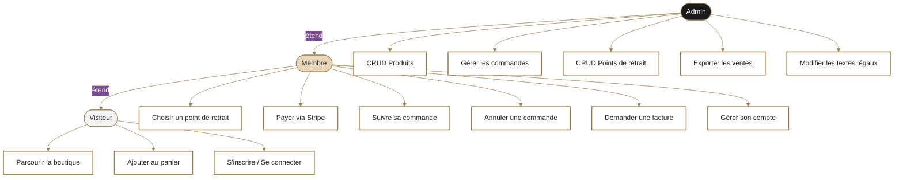
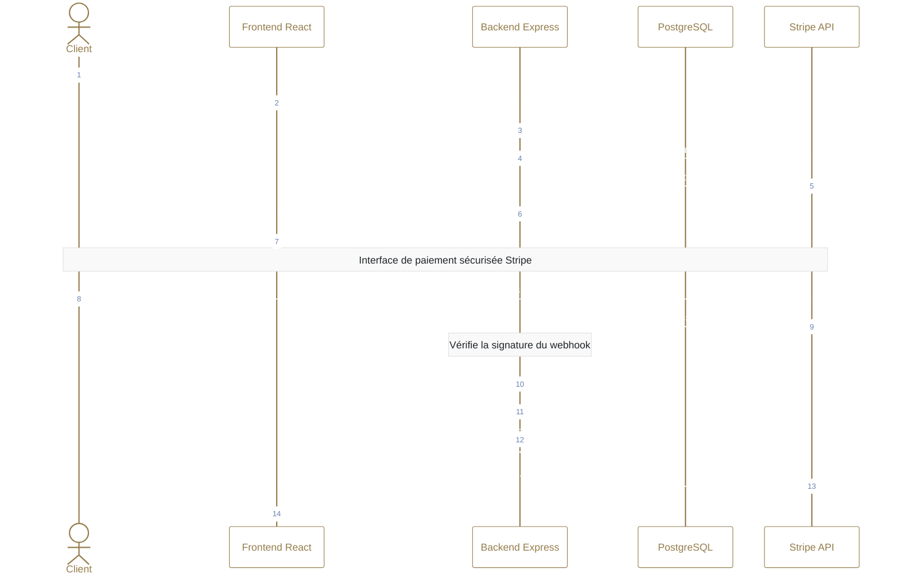

# Dossier de Conception — Apilace E-Commerce

> **Version :** 1.0
> **Date :** Avril 2026
> **Auteur :** Valentin
> **Statut :** MVP — En cours de conception

---

## Table des matières

1. [Présentation générale](#1-présentation-générale)
2. [Public cible et besoins](#2-public-cible-et-besoins)
3. [Rôles utilisateurs](#3-rôles-utilisateurs)
4. [User Stories](#4-user-stories)
5. [Cas d'utilisation (Use Cases)](#5-cas-dutilisation-use-cases)
6. [Périmètre fonctionnel](#6-périmètre-fonctionnel)
7. [Architecture et stack technique](#7-architecture-et-stack-technique)
8. [Modélisation des données](#8-modélisation-des-données)
9. [Flux applicatifs](#9-flux-applicatifs)
10. [Sécurité](#10-sécurité)
11. [Analyse des risques](#11-analyse-des-risques)
12. [Planning de réalisation](#12-planning-de-réalisation)
13. [Évolutions futures (V2)](#13-évolutions-futures-v2)

---

## 1. Présentation générale

### Contexte

**Apilace®** est une marque horlogère française haut de gamme spécialisée dans la conception de montres inspirées du biomimétisme. Le site vitrine existant ([apilace.com](https://www.apilace.com)) présente les créations, l'histoire de la marque et les articles de presse.

### Objectif du projet

Étendre le site vitrine en une **plateforme e-commerce Click & Collect** permettant la vente en ligne de montres de luxe avec retrait en point de dépôt partenaire. Le nouveau service sera développé en parallèle, sans altérer le site existant.

### Contraintes

- **Sécurité maximale** : transactions bancaires via Stripe, données personnelles RGPD
- **Cohérence visuelle** : respect total de la charte graphique Apilace® existante
- **Click & Collect uniquement** : pas de livraison à domicile en V1
- **Durée** : 6 semaines (240 heures) — stage

---

## 2. Public cible et besoins

### Public cible

| Profil | Description |
|---|---|
| **Client final** | Amateur / collectionneur de montres haut de gamme, habitué aux achats en ligne sécurisés |
| **Administrateur** | Le créateur de la marque (ou un collaborateur délégué), gérant le catalogue et les commandes |

### Besoins identifiés

| Besoin (problème identifié) | Solution apportée |
|---|---|
| Pas de possibilité d'achat en ligne sur le site actuel | Boutique e-commerce intégrée avec paiement sécurisé Stripe |
| Logistique complexe pour une livraison à domicile en solo | Click & Collect via un réseau de points de dépôt partenaires (réseau personnel) |
| Gestion manuelle du catalogue et des stocks | Interface Admin CRUD avec gestion temps réel des stocks et disponibilités |
| Absence d'espace client | Espace membre avec suivi de commandes, factures et droits RGPD |
| Communication post-achat absente | Emails transactionnels automatisés (Resend) à chaque étape clé |

---

## 3. Rôles utilisateurs

### Visiteur (non connecté)

Accès en lecture à la boutique. Peut ajouter des produits au panier. Doit créer un compte pour finaliser un achat.

### Membre (client connecté)

Accès à toutes les fonctionnalités d'achat : tunnel de commande, paiement Stripe, espace client (suivi, facture, rétractation).

### Administrateur

Accès à l'interface d'administration complète : gestion du catalogue, des commandes, des points de retrait et des exports comptables.

---

## 4. User Stories

### 4.1 Visiteur (Prospect)

| ID | En tant que... | Je veux... | Afin de... |
|:---|:---|:---|:---|
| US.1 | Visiteur | Accéder à un formulaire de création de compte | Devenir membre et sauvegarder mes informations |
| US.2 | Visiteur | Me connecter avec un lien "Mot de passe oublié" | Accéder à mon espace sécurisé |
| US.3 | Visiteur | Ajouter un produit au panier et voir le récapitulatif | Préparer ma commande avant validation |
| US.4 | Visiteur | M'inscrire pendant le tunnel d'achat sans perdre le panier | Finaliser ma commande sans friction |
| US.5 | Visiteur | M'inscrire à la newsletter | Recevoir les actualités de la marque |

### 4.2 Membre (Client)

| ID | En tant que... | Je veux... | Afin de... |
|:---|:---|:---|:---|
| US.6 | Membre | Choisir un point de retrait parmi une liste | Récupérer ma montre à l'endroit qui me convient |
| US.7 | Membre | Payer via une interface sécurisée (Stripe) | Finaliser mon achat en toute confiance |
| US.8 | Membre | Annuler ma commande sous 14 jours | Exercer mon droit de rétractation légal |
| US.9 | Membre | Demander une facture dématérialisée | Disposer d'une preuve d'achat |
| US.10 | Membre | Supprimer mon compte | Faire valoir mon droit à l'oubli (RGPD) |

### 4.3 Administrateur (Commerçant)

| ID | En tant que... | Je veux... | Afin de... |
|:---|:---|:---|:---|
| US.11 | Admin | CRUD les produits (photos, stocks, prix, tailles) | Gérer mon catalogue de manière évolutive |
| US.12 | Admin | Activer / désactiver la vente d'un produit | Gérer la disponibilité en temps réel |
| US.13 | Admin | Valider une commande et notifier le client | Prévenir que le produit est prêt en point de retrait |
| US.14 | Admin | Annuler et rembourser une commande | Gérer les litiges ou erreurs de stock via Stripe |
| US.15 | Admin | CRUD les points de retrait (adresse, horaires, jours) | Mettre à jour les lieux de retrait disponibles |
| US.16 | Admin | Télécharger un export des ventes (CSV / PDF) | Faciliter la gestion comptable |
| US.17 | Admin | Modifier les textes légaux (CGV / RGPD) | Rester en conformité avec les conseils juridiques |
| US.18 | Admin | Gérer les rôles des comptes (Admin) | Déléguer la gestion du site en toute sécurité |

---

## 5. Cas d'utilisation (Use Cases)

### Diagramme global



### Diagramme de séquence — Flux de paiement Stripe (Click & Collect)



---

## 6. Périmètre fonctionnel

### MVP — Fonctionnalités incluses

- **Boutique** : Catalogue produits avec filtres, fiche produit détaillée (images, tailles, description)
- **Panier** : Persistance avant et après connexion (localStorage → BDD au login)
- **Authentification** : Inscription, connexion, mot de passe oublié, Google Auth, déconnexion
- **Tunnel d'achat** : Sélection du point de retrait (select avec adresse + horaires), paiement Stripe
- **Espace Client** : Historique des commandes, statut en temps réel, demande de facture, rétractation 14j
- **RGPD** : Suppression de compte (soft delete), consentement newsletter
- **Administration** : CRUD produits et points de retrait, mise à jour des statuts commandes, remboursement Stripe, export CSV/PDF, gestion des textes légaux

### Hors périmètre V1

- Livraison à domicile
- PayPal (intégration possible en V2)
- Programme fidélité
- Avis clients / notation produits
- Système de promotions / codes promo

---

## 7. Architecture et stack technique

### Stack

| Couche | Technologie | Rôle |
|---|---|---|
| **Frontend** | React.js + TypeScript | Interface utilisateur SPA |
| **UI** | Chakra UI | Composants et thème |
| **Validation front** | Zod | Schémas de formulaires côté client |
| **HTTP client** | Axios | Requêtes vers l'API |
| **Backend** | Node.js + Express | Serveur API REST |
| **ORM** | Prisma | Modélisation et requêtes BDD |
| **Base de données** | PostgreSQL | Persistance des données |
| **Environnement dev** | Docker + Docker Compose | Isolation et reproductibilité locale |
| **Paiement** | Stripe API | Checkout sécurisé + webhooks + remboursements |
| **Emails** | Resend | Emails transactionnels |
| **Images** | Cloudinary | Stockage et optimisation des images produits |
| **Auth sociale** | Google OAuth 2.0 | Connexion rapide via compte Google |
| **CI/CD** | GitHub Actions | Tests et déploiement automatisés |
| **Tests** | Vitest | Tests unitaires et d'intégration |
| **Qualité** | Husky + Commitlint | Conventions de commits et hooks pre-commit |

### Sécurité

| Mécanisme | Technologie | Détail |
|---|---|---|
| Authentification | JWT (Access + Refresh Token) | Double token avec rotation, stockés en cookies HttpOnly |
| Hachage | Argon2 | Mots de passe irréversibles et salés |
| Protection CSRF | Double Submit Cookie | Header `X-XSRF-TOKEN` obligatoire sur toutes les mutations |
| Validation | Zod | Schémas stricts côté front **et** back |
| Webhook Stripe | Signature verification | Vérification de la signature à chaque événement reçu |

### Architecture Docker (développement)

```
docker-compose.yml
├── db          → PostgreSQL (port 5432)
├── backend     → Express + Prisma (port 3000, hot reload)
└── frontend    → React + Vite (port 5173, hot reload)
```

Les volumes sont montés pour persister les données PostgreSQL entre les redémarrages. Un fichier `.env.example` documente toutes les variables d'environnement requises.

---

## 8. Modélisation des données

### MLD (Modèle Logique de Données)

```mermaid
erDiagram
    USERS {
        int id PK
        string email
        string password_hash
        string google_id
        string role
        boolean is_deleted
        datetime created_at
    }

    PRODUCTS {
        int id PK
        string name
        string slug
        decimal price
        boolean is_active
        datetime created_at
    }

    PRODUCT_IMAGES {
        int id PK
        int product_id FK
        string url
        boolean is_primary
        int position
    }

    PRODUCT_SIZES {
        int id PK
        int product_id FK
        string size
        int stock
    }

    STORES {
        int id PK
        string name
        string address
        string city
        string postal_code
        jsonb opening_hours
        boolean is_active
    }

    ORDERS {
        int id PK
        int user_id FK
        int store_id FK
        string status
        decimal total_amount
        string stripe_session_id
        datetime created_at
    }

    ORDER_ITEMS {
        int id PK
        int order_id FK
        int product_id FK
        string size
        int quantity
        decimal unit_price
    }

    MESSAGES {
        int id PK
        int user_id FK "Nullable"
        string email
        text content
        datetime created_at
    }

    REFRESH_TOKENS {
        int id PK
        int user_id FK
        string token_hash
        datetime expires_at
    }

    NEWSLETTER {
        int id PK
        string email
        boolean is_active
    }

    LEGAL_PAGES {
        int id PK
        string type
        text content
    }

    %% Relations techniques (Clés Étrangères)
    USERS ||--o{ ORDERS : "possède (user_id)"
    USERS ||--o{ MESSAGES : "envoie (user_id)"
    USERS ||--o{ REFRESH_TOKENS : "détient (user_id)"
    
    STORES ||--o{ ORDERS : "reçoit (store_id)"
    
    ORDERS ||--|{ ORDER_ITEMS : "détaille (order_id)"
    
    PRODUCTS ||--o{ ORDER_ITEMS : "apparaît (product_id)"
    PRODUCTS ||--|{ PRODUCT_IMAGES : "illustré_par (product_id)"
    PRODUCTS ||--|{ PRODUCT_SIZES : "disponible_en (product_id)"
```



### Schéma relationnel (Prisma)

```
users (
  id              SERIAL        PRIMARY KEY,
  email           VARCHAR(255)  NOT NULL UNIQUE,
  password_hash   VARCHAR(255),                    -- NULL si Google Auth
  google_id       VARCHAR(255)  UNIQUE,
  first_name      VARCHAR(100),
  last_name       VARCHAR(100),
  role            VARCHAR(20)   DEFAULT 'MEMBER',  -- MEMBER | ADMIN
  is_deleted      BOOLEAN       DEFAULT false,     -- Soft delete RGPD
  created_at      TIMESTAMP     DEFAULT NOW(),
  updated_at      TIMESTAMP     DEFAULT NOW()
)

products (
  id              SERIAL        PRIMARY KEY,
  name            VARCHAR(255)  NOT NULL,
  slug            VARCHAR(255)  NOT NULL UNIQUE,
  description     TEXT,
  price           DECIMAL(10,2) NOT NULL,
  is_active       BOOLEAN       DEFAULT true,
  created_at      TIMESTAMP     DEFAULT NOW(),
  updated_at      TIMESTAMP     DEFAULT NOW()
)

product_images (
  id              SERIAL        PRIMARY KEY,
  product_id      INT           NOT NULL REFERENCES products(id) ON DELETE CASCADE,
  url             VARCHAR(500)  NOT NULL,            -- URL Cloudinary
  is_primary      BOOLEAN       DEFAULT false,
  position        INT           DEFAULT 0
)

product_sizes (
  id              SERIAL        PRIMARY KEY,
  product_id      INT           NOT NULL REFERENCES products(id) ON DELETE CASCADE,
  size            VARCHAR(20)   NOT NULL,            -- S | M | L | Standard
  stock           INT           NOT NULL DEFAULT 0,
  UNIQUE(product_id, size)
)

stores (
  id              SERIAL        PRIMARY KEY,
  name            VARCHAR(255)  NOT NULL,
  address         TEXT          NOT NULL,
  city            VARCHAR(100)  NOT NULL,
  postal_code     VARCHAR(10)   NOT NULL,
  opening_hours   JSONB         NOT NULL,            -- { "lun": "10h-18h", "mar": "10h-18h", ... }
  is_active       BOOLEAN       DEFAULT true,
  created_at      TIMESTAMP     DEFAULT NOW()
)

orders (
  id              SERIAL        PRIMARY KEY,
  user_id         INT           NOT NULL REFERENCES users(id),
  store_id        INT           NOT NULL REFERENCES stores(id),
  stripe_session_id VARCHAR(255) UNIQUE,
  stripe_payment_intent_id VARCHAR(255) UNIQUE,
  status          VARCHAR(30)   DEFAULT 'PENDING',  -- PENDING | PAID | READY | COLLECTED | CANCELLED | REFUNDED
  total_amount    DECIMAL(10,2) NOT NULL,
  created_at      TIMESTAMP     DEFAULT NOW(),
  updated_at      TIMESTAMP     DEFAULT NOW()
)

order_items (
  id              SERIAL        PRIMARY KEY,
  order_id        INT           NOT NULL REFERENCES orders(id) ON DELETE CASCADE,
  product_id      INT           NOT NULL REFERENCES products(id),
  size            VARCHAR(20)   NOT NULL,
  quantity        INT           NOT NULL DEFAULT 1,
  unit_price      DECIMAL(10,2) NOT NULL             -- Prix au moment de la commande (snapshot)
)

product_sections (
  id           SERIAL        PRIMARY KEY,
  product_id   INT           NOT NULL REFERENCES products(id) ON DELETE CASCADE,
  type         VARCHAR(20)   NOT NULL,        -- IMAGE_TEXT | PRODUCT_CTA
  position     INT           NOT NULL DEFAULT 0,
  image_url    VARCHAR(500),                  -- URL Cloudinary
  text_side    VARCHAR(5)    DEFAULT 'LEFT',  -- LEFT | RIGHT
  title1       VARCHAR(255),
  description1 TEXT,
  text2        VARCHAR(100),
  desc2        TEXT,
  text3        VARCHAR(100),
  desc3        TEXT
  -- PRODUCT_CTA : sélecteur taille lu depuis product_sizes
  -- position 999 réservé au PRODUCT_CTA, toujours en dernier
)

newsletter (
  id              SERIAL        PRIMARY KEY,
  email           VARCHAR(255)  NOT NULL UNIQUE,
  subscribed_at   TIMESTAMP     DEFAULT NOW(),
  is_active       BOOLEAN       DEFAULT true
)

messages (
  id              SERIAL        PRIMARY KEY,
  user_id         INT           REFERENCES users(id),   -- NULL si visiteur
  email           VARCHAR(255)  NOT NULL,
  first_name      VARCHAR(100),
  last_name       VARCHAR(100),
  phone           VARCHAR(30),
  content         TEXT          NOT NULL,
  created_at      TIMESTAMP     DEFAULT NOW()
)

legal_pages (
  id              SERIAL        PRIMARY KEY,
  type            VARCHAR(50)   NOT NULL UNIQUE,    -- CGV | RGPD | MENTIONS_LEGALES
  content         TEXT          NOT NULL,
  updated_at      TIMESTAMP     DEFAULT NOW()
)

refresh_tokens (
  id              SERIAL        PRIMARY KEY,
  user_id         INT           NOT NULL REFERENCES users(id) ON DELETE CASCADE,
  token_hash      VARCHAR(255)  NOT NULL,
  expires_at      TIMESTAMP     NOT NULL,
  created_at      TIMESTAMP     DEFAULT NOW()
)
```

### Statuts de commande — Machine à états

```
PENDING → PAID → READY → COLLECTED
                  ↓
              CANCELLED → REFUNDED
```

| Statut | Déclencheur | Acteur |
|---|---|---|
| `PENDING` | Création de la commande avant paiement | Système |
| `PAID` | Webhook Stripe `checkout.session.completed` | Stripe |
| `READY` | L'admin confirme que la montre est déposée en point de retrait | Admin |
| `COLLECTED` | L'admin confirme le retrait par le client | Admin |
| `CANCELLED` | Annulation par le client (≤ 14j) ou par l'admin | Client / Admin |
| `REFUNDED` | Remboursement traité via Stripe | Admin |

---

## 9. Flux applicatifs

### 9.1 Flux d'emails transactionnels (Resend)

| Événement | Déclencheur | Destinataires | Contenu |
|---|---|---|---|
| Confirmation d'achat | Webhook `checkout.session.completed` | Client + Admin | Récapitulatif commande, détails point de retrait (adresse + horaires) |
| Prêt pour retrait | Admin passe le statut à `READY` | Client | Informations du point de retrait, rappel produit commandé |
| Demande de facture | Client clique "Demander une facture" | Admin | Détails de la commande pour génération manuelle |
| Remboursement confirmé | Admin traite le remboursement | Client | Confirmation du remboursement et délai estimé |

> **Note :** Les informations du point de retrait (adresse, horaires d'ouverture) sont automatiquement incluses dans les emails de confirmation afin de faciliter l'expérience client.

### 9.2 Gestion de la Newsletter

- Les emails sont collectés via un formulaire en pied de page (et optionnellement lors de l'inscription).
- Ils sont centralisés dans la table `newsletter`, indépendante de la table `users` pour couvrir les visiteurs non inscrits.
- Le formulaire de contact du site vitrine existant est redirigé vers la nouvelle API pour unifier les données (table `messages`).

> **À préciser :** La stratégie d'envoi de campagnes (Resend Broadcast ou autre outil) sera définie avec le client avant le développement de cette fonctionnalité.

---

## 10. Sécurité

| Menace | Mesure |
|---|---|
| Vol de session (XSS) | JWT Access Token stocké en cookie HttpOnly — inaccessible depuis le JavaScript |
| Expiration de session | Refresh Token avec rotation (invalide à chaque utilisation) |
| CSRF | Double Submit Cookie : header `X-XSRF-TOKEN` obligatoire sur POST, PATCH, PUT, DELETE |
| Injection SQL | Prisma — requêtes paramétrées, aucun SQL brut |
| Mots de passe | Hachage Argon2 (irréversible, salé automatiquement) |
| Brute force | Rate limiting sur toutes les routes d'authentification |
| Validation des entrées | Schémas Zod validés **côté frontend ET backend** — aucune donnée non validée ne persiste |
| Webhook Stripe frauduleux | Vérification de la signature Stripe avant tout traitement |
| Accès non autorisé | Middlewares `requireAuth` (JWT valide) + `requireAdmin` (rôle ADMIN) |
| Données sensibles exposées | `password_hash` jamais inclus dans les réponses API |
| Compte supprimé | Soft delete avec flag `is_deleted` — les tokens sont invalidés immédiatement |

---

## 11. Analyse des risques

| Risque | Probabilité | Impact | Mesure préventive |
|---|---|---|---|
| Faille dans le flux de paiement | Faible | Critique | Délégation complète à Stripe (aucune donnée bancaire ne transite par le serveur) + vérification signature webhook |
| Régression au déploiement | Moyenne | Élevé | CI/CD GitHub Actions avec tests Vitest + staging avant production |
| Non-conformité RGPD | Faible | Élevé | Soft delete, consentement newsletter explicite, CGV éditables par l'admin |
| Désynchronisation stock / commandes | Moyenne | Élevé | Décrémentation du stock dans la **même transaction Prisma** que la création de commande (post-webhook) |
| Complexité du Docker en dev | Faible | Faible | Docker Compose simple (3 services) avec volumes et `.env.example` documenté |
| Éparpillement hors scope | Élevée | Moyen | Respect strict du MVP, backlog V2 isolé |

---

## 12. Planning de réalisation

**Durée totale : 6 semaines (210 heures) — du 14 avril au 23 mai 2026**

| Semaines | Dates | Phase | Livrables |
|---|---|---|---|
| S1 | 14 → 18 avril | **Fondations & Auth** | Conception finalisée, wireframes, MCD/MLD, Docker Compose, boilerplate front + back, Prisma schema + migration, CI/CD GitHub Actions, Auth complète (JWT + CSRF + Argon2 + cookies HttpOnly) |
| S2 | 21 → 25 avril | **Backend Core** | CRUD Produits (Cloudinary), CRUD Stores, CRUD Users + rôles, validation Zod sur toutes les routes, tests unitaires auth (Vitest) |
| S3 | 28 avril → 2 mai | **Frontend Boutique & Panier** | Boutique (catalogue, filtres), Fiche produit, Panier (localStorage → BDD), Page Checkout, Intégration Stripe (création Checkout Session) |
| S4 | 5 → 9 mai | **Stripe Webhook & Espace Client** | Webhook Stripe + transaction atomique stock, Page /checkout/success, Emails Resend (confirmation + alerte admin + prêt pour retrait), Espace Client (commandes, annulation 14j, demande facture) |
| S5 | 12 → 16 mai | **Dashboard Admin** | Dashboard indicateurs, gestion commandes (statuts + remboursement Stripe), CRUD produits + images Cloudinary, CRUD magasins, gestion utilisateurs, Google OAuth |
| S6 | 19 → 23 mai | **Finition & Mise en prod** | Export CSV ventes, textes légaux éditables, newsletter (collecte + liste admin), polish UI + responsive mobile, recette RGPD, tests d'intégration Vitest, documentation déploiement, **mise en production** |

---

## 13. Évolutions futures (V2)

- **PayPal** : Ajout d'un deuxième moyen de paiement (architecture Stripe déjà découplée)
- **Système d'acomptes** : Paiement de 30% via Stripe à la commande, solde encaissé en main propre au retrait avec bouton admin "Marquer le solde encaissé"
- **Livraison à domicile** : Intégration d'un transporteur (Colissimo, Chronopost)
- **Programme fidélité** : Points accumulés à chaque achat
- **Codes promotionnels** : Système de réduction avec Stripe Coupons
- **Avis clients** : Notation des produits post-achat (envoi email automatique à J+7)
- **Génération de factures automatiques** : Création et envoi automatique d'une facture PDF à chaque achat confirmé, téléchargeable par le client et le gérant depuis leurs espaces respectifs
- **Emails marketing automatisés** : Notification newsletter à chaque nouveau produit ajouté en boutique + relance automatique des paniers abandonnés après un délai configurable
- **Dashboard analytique** : Graphiques de ventes, produits les plus vendus, CA mensuel, taux de conversion, paniers abandonnés
- **Campagnes newsletter** : Envoi groupé via Resend Broadcast ou Mailchimp
- **Application mobile** : React Native avec les mêmes API
- **Gravure personnalisée** : Option de gravure d'initiales sur le boîtier — bien personnalisé = exclusion du droit de rétractation (Article L221-28 du Code de la consommation). Impacte : champ `isPersonalized` sur `OrderItem`, logique d'annulation, fiche produit.
- **Manuel produit PDF** : Upload d'un PDF (manuel d'utilisation, entretien, détails techniques) par produit via l'interface admin. Bouton de téléchargement sur la fiche produit publique. Impacte : champ `manualUrl` sur `Product`, upload Cloudinary en PDF, composant de téléchargement sur `ProductPage`.

---

*Document de conception — Apilace E-Commerce*
*Dernière mise à jour : Avril 2026 — v1.0*
